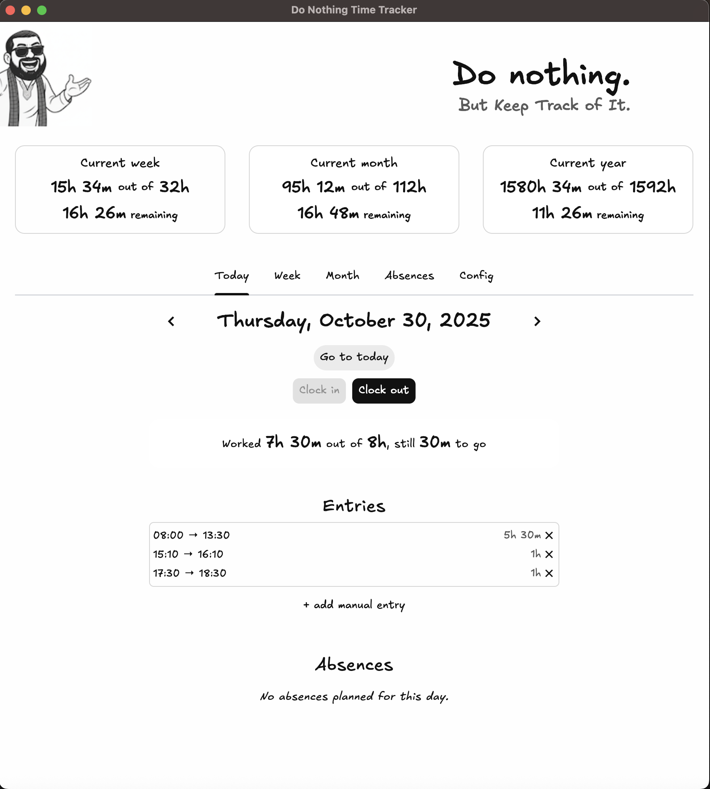

# Do Nothing Time Tracker

A Flet-built desktop/web app for tracking work sessions, projecting expected hours, and comparing against monthly and year-to-date goals.



https://www.youtube.com/watch?v=8An2SxNFvmU

## Features
- One-click clock in/out with automatic prevention of overlapping entries.
- Live "worked time" indicator for the selected day, refreshing every minute.
- Absence manage with multiple-day absences.
- week/month/year level stats: expected hours (based on config + absences), actual totals, and deltas.
- Complete history browser grouped by week, with inline edit/delete/new entry actions.
- JSON persistence

## Project structure
```
config.json                # Legacy config (still read for backwards compatibility)
data/entries/              # Legacy data folder (see below for new default location)
do_nothing_time_tracker/   # Python package with app logic & UI
main.py                    # Entry point executed by Flet
```

### Data & config location

The app now stores config and JSON data in a per-user directory:

- macOS: `~/Library/Application Support/DoNothingTimeTracker/`
- Windows: `%LOCALAPPDATA%\DoNothingTimeTracker\`
- Linux: `${XDG_DATA_HOME:-~/.local/share}/DoNothingTimeTracker/`

Inside that folder you'll find `config.json` plus a `data/` subfolder for entries and absences. You can override the storage path from the **Config → Data storage** field in the UI if you prefer a custom location; leave it blank to stick with the default. (Older setups that still have `config.json` / `data/` next to the repo are read automatically, then migrated to the new location when you save the configuration.)

## Getting started
1. Create a Python 3.10+ virtual environment.
2. Install the package in editable mode (pulls in dependencies automatically):
   ```bash
   pip install -e .
   ```
4. Launch the UI via the installed console script:
   ```bash
   dntt
   ```

Monthly entry files are written to `data/entries/<year>-<month>.json`. Delete or edit them manually if you need to reset data.

## Importing Factorial XLSX exports
If you want to import your current Factorial entries, export a complete version in hh:mm format in xlsx and import it with:

```bash
dntt-import path/to/export.xlsx \
  --output-dir data/entries \
  --absences-dir data/absences 
```
